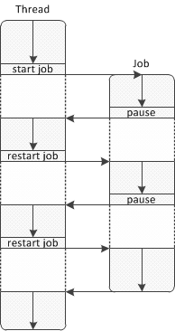
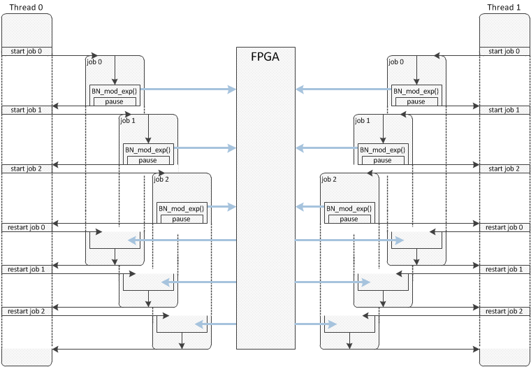

## **[ZoTech FPGA-based RSA accelerator](http://zotechgroup.com/)** ##

# Overview #
**The ZoTech FPGA-based RSA accelerator** speeds-up the Montgomery modular exponentiation operation - the most heavily used operation in RSA algorithms. The accelerator supports a maximum key length of 2048 bits. When implemented as an OpenSSL compliant engine on following platforms the performances achieved are:  
  Amazon AWS F1 instance: up to 28,000 RSA signs per second vs 4,500 signs per second with SW-only implementation.  
  Alveo U250 on Nimbix:    up to 36,000 RSA signs per second vs 9,000 signs per second with SW-only implementation.  

Two basic use cases are presented.
  
**Montgomery Modular Exponentiation direct optimized API**  
* To compile this example please execute the following steps:  
  `cd <path to zt_rsa>/rsa_accel/build/SDx_<platform>`  
  `./make_host_app.sh` This will create a demo executable.  
* To run the example please execute the following steps:  
  `sudo sh` (this step is not needed for Nimbix platform)  
  `./run_hw_<platform>.sh`

**OpenSSL compliant Modular Exponentiation engine API**  
OpenSSL interface to the direct optimized API of the ZoTech RSA accelerator is implemented as an OpenSSL engine shared library **_ZoTech_AWS_RSA_Engine.so_**. The engine replaces **`int BN_mod_exp(BIGNUM *r, BIGNUM *a, const BIGNUM *p, const BIGNUM *m, BN_CTX *ctx)`**. The FPGA-based accelerator is invoked automatically each time OpenSSL performs an RSA cryptographic operation using **`BN_mod_exp()`**. The example assumes the existence of a compiled and installed **OpenSSL v1.1.1a**.
* To compile this example please execute the following steps:  
  `source <path to zt_rsa>/rsa_accel/build/xilinx_<platform>_run_setup`  
  `cd <path to zt_rsa>/rsa_use/rsa_engine/build`  
  `./make_<platform>.sh` This will create shared library.  
  `cd <path to zt_rsa>/rsa_use/rsa_sign_demo/build`  
  `./make.sh` This will create a demo executable.  
* To run the example please execute the following steps:  
  `sudo sh` This step is not needed for the Nimbix platform.  
  `./run_hw_<platform>.sh`

The application performs calculations and shows performance measuremens as below:

    Overal statistic:
    
    Total time              : 8.34 sec
    Average time per sign   : 27.79 us
    Average sign per second : 35984
    
    Engine statistic:

    Total multiplication performed      : 600000
    Total time spent by FPGA            : 6.54 sec
    Average time per one multiplication : 10.90 us
    Average FPGA load                   : 96.6 %

If you would like to compare the speed with the pure SW implementation, please run `run_sw_ssl.sh` instead of `run_hw_<platform>.sh`

**Please check [ZoTech GitHub repository](https://github.com/ZoTechGroup/zt_rsa "ZoTech GitHub repository") to get the latest examples and documentation.** By default it is clonned to "/home/centos/src/project_data/zt_rsa" directory on AWS and to "/opt/example/zt_rsa" directory on Nimbix.

# How to use OpenSSL compliant HW accelerator in your application #

To use the **ZoTech OpenSSL compliant RSA accelerator** as it is, your application should be OpenSSL-based. In case you have a more efficient implementation of RSA, you can replace OpenSSL's functions with your own implementation and call **`BN_mod_exp()`** each time you need to invoke the HW accelerator to perform multiplication.

The best performance can be achieved by combining multithread mode with OpenSSL's ASYNC_JOB: the application creates threads and each thread creates some number of ASYNC_JOBs. The recommended number of threads is `<number of CPU on F1 instance> - 2`

**_Important note:_** *ZoTech FPGA-based RSA accelerator supports multithreading, but doesn't support multiprocessing. This means that your application can create some number of threads with ASYNC_JOBs and call **`BN_mod_exp()`** from these threads and ASYNC_JOBs but can't use **`fork`** to duplicate the process*

## 1. Load engine ##

To load the **_ZoTech_AWS_RSA_Engine_** shared library use OpenSSL's `dynamic` engine designated to load and link external OpenSSL engines. Do the following steps:

* `ENGINE *e = ENGINE_by_id("dynamic");` - create instance of dynamic engine 
* `ENGINE_ctrl_cmd_string(e, "SO_PATH", "/opt/Zotech_AWS_RSA_Engine.so", 0);` - set path to **_ZoTech_AWS_RSA_Engine_**
* `ENGINE_ctrl_cmd_string(e, "ID"     , "zotech_aws_rsa_kernel", 0);` - set ID to **_ZoTech_AWS_RSA_Engine_**
* `ENGINE_ctrl_cmd_string(e, "LOAD"   , NULL                   , 0);` - load **_ZoTech_AWS_RSA_Engine_**
* `ENGINE_init(e)` - initialize **_ZoTech_AWS_RSA_Engine_**
* `ENGINE_set_default_RSA(e)` - set **_ZoTech_AWS_RSA_Engine_** as the default engine for all RSA operation

The complete code example is available in **RSA_Sign_Demo.cpp** in function `main()`.

## 2. Use ASYNC_JOBs ##

OpenSSL ASYNC_JOB permits the optimization of resource utilization by switching between jobs when one needs to wait for data for processing or event. A thread starts ASYNC_JOB and then the job runs until it reaches a point when it needs to wait. At this point the job will pause and the control will return to the thread. A thread could continue to perform its own work and at some point restarts the job as shown in the illustration below:

The **`BN_mod_exp()`** implementation in **_ZoTech_AWS_RSA_Engine_** provides the best performance when it is called from ASYNC_JOB. After **`BN_mod_exp()`** forwards the data to the FPGA for computation, it pauses the current job and the next job in the same thread can call **`BN_mod_exp()`** with its data. Others threads are able to perform the same operations in parallel. This process is illustrated in the image below:

In order to run the RSA using FPGA, define the job's functions to perform the desired type of cryptographic operations. For example, in **RSA_Sign_Demo.cpp** ASYNC_JOB to perform signing is defined as:

    int Sign_Job(void *arg)
    {
      sign_job_arg *a = (sign_job_arg *)arg;
    
      unsigned int sign_len = KEY_BYTE_SIZE;
    
      RSA_sign(NID_sha256, a->hash, SHA256_DIGEST_LENGTH, a->sign,  &sign_len, a->key);
    
      return 1;
    }
    

Start and restart jobs in a loop until all jobs complete the desired cryptographic operations. For example:

    while(1)
      {
        int nj = 0;               // Number of completed jobs

        for(int k = 0; k < job_qnt; k++)
          {
            if( job_stat[k] == ASYNC_FINISH )      // If job completed then count it and don't start again
              { nj++; continue; }
                                                   // ASYNC_start_job() start or restart job depending on current job status

            job_stat[k] = ASYNC_start_job(&job[k], wctx, &retvalue[k], Sign_Job, (void *)&job_arg[k], sizeof(sign_job_arg));
          }

        if( nj == job_qnt )
          break;
      }

## 3. Get statistics from engine ##

**_ZoTech_AWS_RSA_Engine_** collects information which is useful for performance calculations and during the application optimization process. The engine implements a standard OpenSSL engine interface to collect this information. Commands are defined in **RSA_Sign_Demo.h** as the following enum:

    enum aws_rsa_engine_cmd
      {
        ZTE_CMD_TOTAL_MULT_QNT = ENGINE_CMD_BASE,
        ZTE_CMD_TOTAL_TIME,
        ZTE_CMD_AVERAGE_TIME,
        ZTE_CMD_AVERAGE_LOAD
      };

The **`ENGINE_CMD_BASE`** is an OpenSSL constant.

| Command | Description |
|-|-|
|ZTE_CMD_TOTAL_MULT_QNT| Return total number of multiplication performed by engine|
|ZTE_CMD_TOTAL_TIME| Return total time spent by FPGA in seconds|
|ZTE_CMD_AVERAGE_TIME| Return average time spent per one multiplication in microseconds |
|ZTE_CMD_AVERAGE_LOAD| Return average FPGA load in percent|

All values returned by the engine have type **`double`**. To access them, use the following code

    double p;

    if( ENGINE_ctrl(e, ZTE_CMD_TOTAL_MULT_QNT, sizeof(double), &p, NULL) )  
      printf("Total multiplication performed      : %d\n"       , (int)p );

    if( ENGINE_ctrl(e, ZTE_CMD_TOTAL_TIME    , sizeof(double), &p, NULL) )  
      printf("Total time spent by FPGA            : %3.2f sec\n", p );

    if( ENGINE_ctrl(e, ZTE_CMD_AVERAGE_TIME  , sizeof(double), &p, NULL) )  
      printf("Average time per one multiplication : %3.2f us\n" , p );

    if( ENGINE_ctrl(e, ZTE_CMD_AVERAGE_LOAD  , sizeof(double), &p, NULL) )
      printf("Average FPGA load                   : %3.1f %%\n" , p*100.0 );

-------------------

**For more information please visit <http://zotechgroup.com>
or contact by email <info@zotechgroup.com>**
